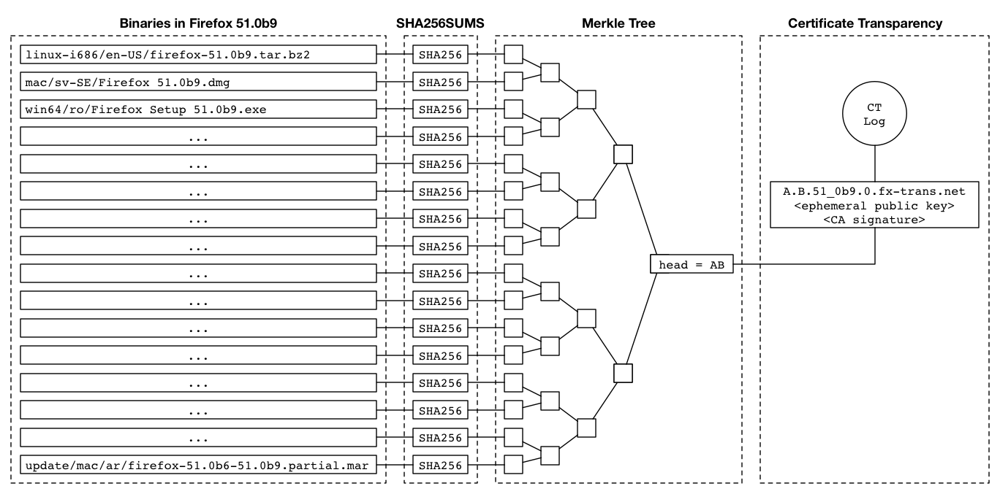
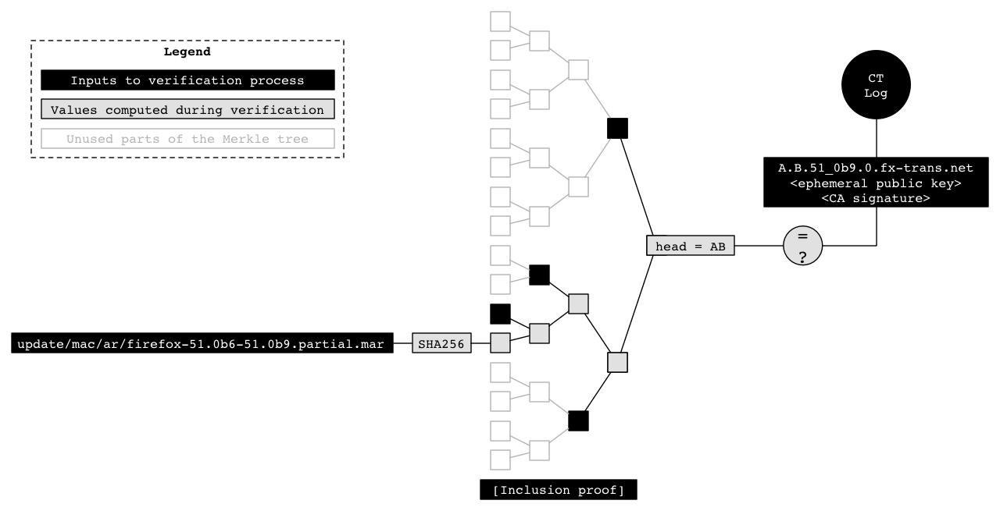

# Original Mozilla Binary Transparency Design Doc

Note: this is a mirror/backup of a doc from the [Mozilla Firefox team](https://wiki.mozilla.org/Security/Binary_Transparency)

## Goal

Allow third parties to verify that all Firefox binaries are public, i.e., that they have gotten the same version as the rest of the world and not a special, possibly compromised version.

This can serve as a foundation for later work to verify that the distributed binaries are faithfully built from the Firefox source code (e.g., via reproducible builds).

## Background and Approach

"Sunlight is said to be the best of disinfectants; electric light the most efficient policeman." -- Louis Brandeis [[1]](https://en.wikipedia.org/wiki/Louis_Brandeis)

One of the major promises of open-source is that you know what’s in your software. However, in practice, people almost always download compiled binaries of Firefox and take binary updates -- with no assurance that these binaries actually correspond to the Firefox source code. We need to provide this assurance in order to guard against the use of our systems either to ship large-scale malware or to deliver targeted bad updates to specific users.

Work is ongoing to strengthen internal controls so that it is less likely that the build chain will be subverted by malicious actors. The goal of this work is to provide external controls that will bound the impact of any compromise as well as protecting against deliberate action by Mozilla (e.g., as a result of coercion).

The first step in establishing this control is to **ensure that all Firefox binaries are logged in a publicly verifiable log**. This ensures that when users download Firefox, they can verify that their copy of Firefox is the same one that we gave to everyone else, and not a special copy just for them. Public logging is also the foundation for the second step, which is for the Firefox updater to **automatically verify that updates have been logged before accepting and installing them**.

Once we have ensured that everyone gets the same binaries third parties can analyze these binaries to verify that these binaries are faithfully created from the Firefox source code. However, this verification work is not the immediate focus of this project.

This document lays out the overall architecture for the binary transparency work we are doing in Firefox. For progress, please see the [meta bug](https://bugzilla.mozilla.org/show_bug.cgi?id=1341395)and the tracking bugs linked below.

## Terminology

- Binary - A specific executable file or update file produced by the build process, for example [https://ftp.mozilla.org/pub/firefox/releases/51.0b9/update/win64/en-ZA/firefox-51.0b9.complete.mar](https://ftp.mozilla.org/pub/firefox/releases/51.0b9/update/win64/en-ZA/firefox-51.0b9.complete.mar)

- Release - The set of all binaries for a given version of Firefox, e.g., for 51.0b9, all of the files in [this directory](https://ftp.mozilla.org/pub/firefox/releases/51.0b9/)

- [Merkle Tree](https://en.wikipedia.org/wiki/Merkle_tree) - A cryptographic data structure that enables the creation of certain artifacts from a set of inputs:
    - A single hash value called the “tree head” that can be used to represent the set
    - An “inclusion proof” for any element of the set that proves that the element is in the set using a number of hash values equal to the log of the size of the set

## Logging Releases

Tracking Bug:

- [https://bugzilla.mozilla.org/show_bug.cgi?id=1341396](https://bugzilla.mozilla.org/show_bug.cgi?id=1341396)

When a release of Firefox is created, we need to log a description of that release to a publicly verifiable log. The approach we are taking here is to layer this Binary Transparency system on top of the existing Certificate Transparency system, by computing a hash value that summarizes the release, putting that value in a certificate, and logging the certificate. Then a third party can verify that a binary was logged by verifying that the binary is included in the Merkle tree with the tree head in the certificate, then verifying that the certificate was logged.

### Steps to Log

When a beta or release version of Firefox is created, there is already code in place to create a SHA512SUMS file, with a SHA-512 digest of each binary included in the release; there is [work in progress] to produce an equivalent SHA256SUMS file. The logging process starts from that file.

1. Compute a Merkle tree over the digests in the SHA256SUMS file, following the process described in [RFC 6962](https://tools.ietf.org/html/rfc6962#section-2.1) and using the SHA-256 hash function. This results in a Merkle tree head that summarizes the files in the release and their contents.
2. Construct a domain name that includes the tree head and the version label for the release, with the following labels from left to right:
    1. The first 16 bytes of the tree head, hex-encoded
    2. The second 16 bytes of the tree head, hex-encoded
    3. The version label for the release, with “.” characters changed to “-”
    4. A label for the version of binary transparency scheme used to generate this tree head, currently “0”
    5. The fixed domain name suffix 

fx-trans.net
    6. For example, if the Merkle tree head for Firefox 51.0b9 is 

151eec404a908104927fdb411d4f73accc6ed5bba41d85b0ae44107694c5f8f1, then the resulting domain name is 

151eec404a908104927fdb411d4f73ac.cc6ed5bba41d85b0ae44107694c5f8f1.51-0b9.0.fx-trans.net

3. Obtain a certificate containing that domain name.
4. Submit the certificate to a Certificate Transparency log.

TBD:

- Which CA(s) will be used to issue certificates
- Which log(s) will be used to log certificates

### Steps to Verify

To verify all of the binaries in a release, the verifier can take the following steps:

1. Obtain the following artifacts:
    1. The binaries in the release
    2. The SHA256SUMS file for the release
    3. A certificate for the release
    4. An SCT or inclusion proof for the certificate from the CT log

2. Verify the SCT or inclusion proof to check that the certificate was logged
3. Compute the Merkle tree head over the SHA256SUMS and construct the corresponding domain name as described above.
4. Check that that the certificate contains the domain name.
5. Check that the files in the release correspond to the entries in the SHA256SUMS file.

A verifier that doesn’t want to download the whole release can still build confidence by first verifying the SHA256SUMS file (i.e., performing steps 2-4), then spot-checking a selection of files against the SHA256SUMS file.

In particular, a verifier that only cares about one binary (e.g., the one they’re running) can just check that file against the verified SHA256SUMS file. Note that the single-file case can also be addressed by using a Merkle inclusion proof from the file in question to the tree head in the certificate (as discussed below for updates); the method based on the SHA256SUMS file provides a slightly simpler method in cases where the verifier is willing to download the whole SHA256SUMS file (since the verifier does not need to implement the inclusion proof checking algorithm).

## Enforcing Logging of Updates

Tracking bugs:

- [https://bugzilla.mozilla.org/show_bug.cgi?id=1341397](https://bugzilla.mozilla.org/show_bug.cgi?id=1341397)
- [https://bugzilla.mozilla.org/show_bug.cgi?id=1341398](https://bugzilla.mozilla.org/show_bug.cgi?id=1341398)

Once Firefox releases are being logged, the Firefox updater should not accept an update unless it comes from a logged release. In order to do this, the updater needs sufficient metadata to perform the verification. Rather than sending out the whole SHA256SUMS file (around 500kB), we will send out an inclusion proof for the update (around 300B).

1. In the update metadata distributed by [Balrog](https://wiki.mozilla.org/Balrog), add the following metadata:
    1. Once per release: A certificate containing the Merkle tree head for the release
    2. Once per release: A Signed Certificate Timestamp attesting to the logging of the certificate
    3. Once per update: An inclusion proof to the Merkle tree head for the release

2. When an update is downloaded, Firefox verifies this metadata before passing the update to the updater.
    1. Verify that the SCT covers the certificate and comes from a trusted log
    2. Compute the expected tree head from the update and the inclusion proof
    3. Verify that the computed tree head matches the three head in the certificate

TBD:

- Which logs are trusted, and in what combination
- How metadata will be passed through Balrog

